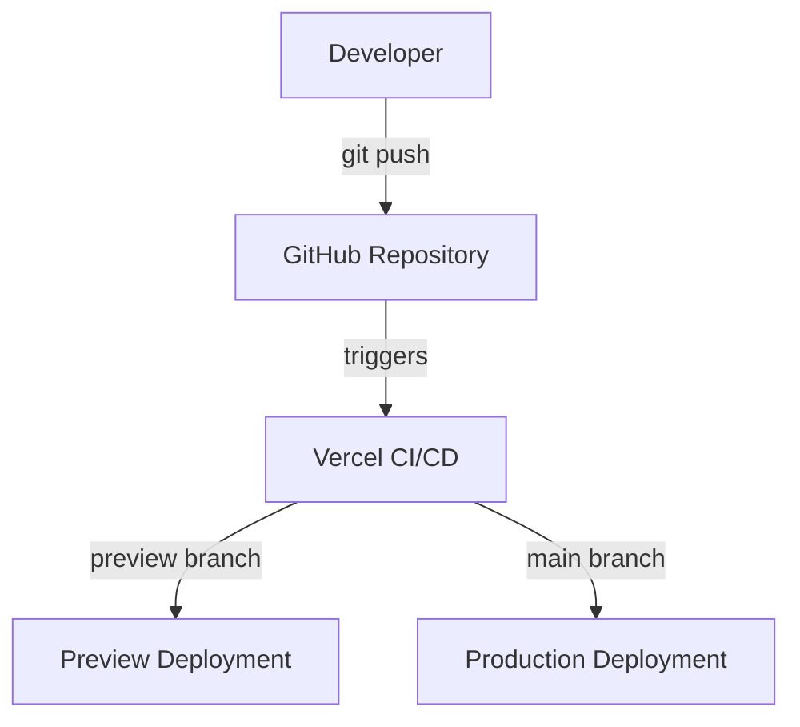

# NextVibe


> A modern Next.js application powered by Strapi CMS with responsive image optimization and automated CI/CD via Vercel.

🔗 **Live Demo:** https://nextvibe-hazel.vercel.app/

---

## Table of Contents

- [Project Setup](#project-setup)
- [Tech Stack & Tooling](#tech-stack--tooling)
- [Environment Variables](#environment-variables)
- [Deployment & CI/CD](#deployment--cicd)
- [Image Optimization](#image-optimization)
- [Roadmap](#roadmap)
- [License](#license)

---

## Project Setup

```sh
pnpm install
```

### Run Development Server

```sh
pnpm dev
```

### Build for Production

```sh
pnpm build
```

### Start Production Server

```sh
pnpm start
```

### Lint

```sh
pnpm lint
```

---

## Tech Stack & Tooling

| Category   | Tool                       |
| ---------- | -------------------------- |
| Framework  | Next.js (App Router)       |
| CMS        | Strapi (Cloud)             |
| Language   | TypeScript                 |
| Styling    | Tailwind CSS               |
| Images     | next/image + custom loader |
| Deployment | Vercel                     |
| Content    | ReactMarkdown              |

---

## Environment Variables

### Example .env

```sh
NEXT_PUBLIC_STRAPI_URL=https://your-project.strapiapp.com
NEXT_PUBLIC_STRAPI_MEDIA_URL=https://your-project.media.strapiapp.com
NEXT_PUBLIC_SITE_URL=https://your-project.com
STRAPI_API_TOKEN=
```

---

## Deployment & CI/CD

The project is deployed on Vercel with automatic CI/CD.

- `main` → Production
- `develop` → Preview deployments



---

## Strapi Integration

Content is fetched from Strapi using REST API:

```ts
/api/about?populate[blocks][populate]=*&locale=de
```

---

## Image Optimization

Images are handled using `next/image` with a custom Strapi loader.

### Features

- Supports Strapi formats (`thumbnail`, `small`, `medium`, `large`)
- Works with both:
  - Local development (`localhost:1337`)
  - Strapi Cloud (`*.media.strapiapp.com`)

- Responsive images via `srcset` and `sizes`
- Lazy loading by default

---

## Roadmap

### Content & Articles

- [x] Integrate Strapi CMS for article content
- [x] Render articles using `react-markdown` for rich-text support
- [ ] Display list of articles on the home page
- [ ] Article detail page with SEO-friendly URLs
- [ ] Categories / tags for filtering articles

### User & Author Management

- [ ] Author registration and login system
- [ ] Author dashboard to create, edit, and delete articles
- [ ] Role-based access control (authors vs admins)

### Pages & Navigation

- [ ] Home page
- [ ] About page
- [ ] Contact page (form integration)
- [ ] Impressum / legal notice page
- [ ] Footer and header navigation across pages

### Newsletter & Email

- [ ] Newsletter subscription form
- [ ] Integrate with email service provider (e.g., Mailchimp or Firebase)
- [ ] Manage subscriber list and send newsletters

### UI & UX Enhancements

- [ ] Responsive layout with Tailwind CSS
- [x] Dark mode toggle
- [x] Optimized images with `next/image` and custom loader
- [x] Lazy loading for below-the-fold images (largest content paint)
- [ ] Hero sections / featured articles

### Search & Interaction

- [ ] Search and filter articles
- [ ] Favorite / bookmark articles
- [ ] Comments section (optional)

### Testing & Quality

- [ ] Unit tests with Jest
- [ ] E2E tests with Playwright or Cypress
- [ ] SEO optimization and meta tags

### Deployment & CI/CD

- [x] Automated builds and deployments via Vercel
- [x] Preview environments for feature branches

---

## License

MIT
